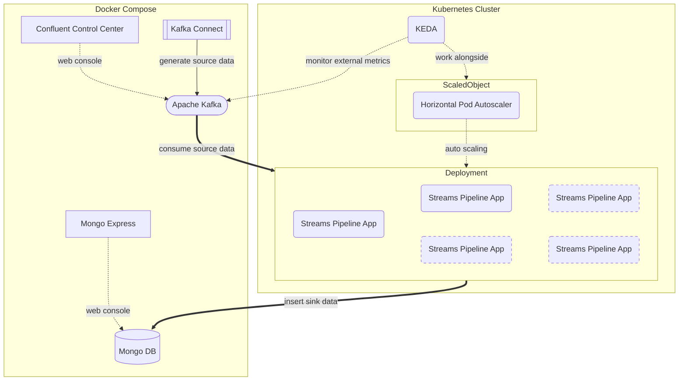

# KEDA Auto Scalable Pipeline
This scalable pipeline horizontally parallelizes processing the data based on an event-driven autoscaler with [KEDA](https://keda.sh/).



## Requirements

- Mac or Linux
- Git
- Docker
- Kubernetes (a cluster & kubectl)
- Helm (ver.3)

## Quick Start Usage

### 1. Setup All Resources

```bash
./scripts/setup.sh
```

### 2. Check The Number of Pods in Pipeline Deployment

```bash
kubectl get pods -n pipeline
```

### 3. Start Generating Source Data from Kafka Connect

```bash
./scripts/start-datagen.sh
```

### 4. Observe Pipeline Processing

- see the sink data on the web console: 'Mongo Express'

    http://localhost:18081/db/pipelineSink/pizzaOrderAnalysis/

- see also the source data on the web console: 'Confluent Control Center'

    http://localhost:9021/clusters/

        controlcenter.cluster > Topics > pizzaOrders > Messages

- see also the number of pods in pipeline deployment

    **They will be scaled-out automatically.**

    ```bash
    kubectl get pods -n pipeline
    ```

## Cleanup

### 1. Stop Generating Source Data

```bash
./scripts/stop-datagen.sh
```

### 2. Check The Number of Pods in Pipeline Deployment

**They will be scaled-in automatically. (It takes a few minutes.)**

```bash
kubectl get pods -n pipeline
```

### 3. Shutdown All Resources

```bash
./scripts/shutdown.sh
```

## Troubleshoot

If some pods are Error or Evicted, you can remove them with the following script.

```bash
./scripts/tools/remove-anomaly-pods.sh
```

## See Also

- [Kafka Streams Pipeline (my another repository in GitHub)](https://github.com/ogi-iii/kafka-streams-pipeline)
    - the source code of 'Streams Pipeline App'
    - the definitions of Docker Compose including Apache Kafka, Mongo DB, and the other tools
